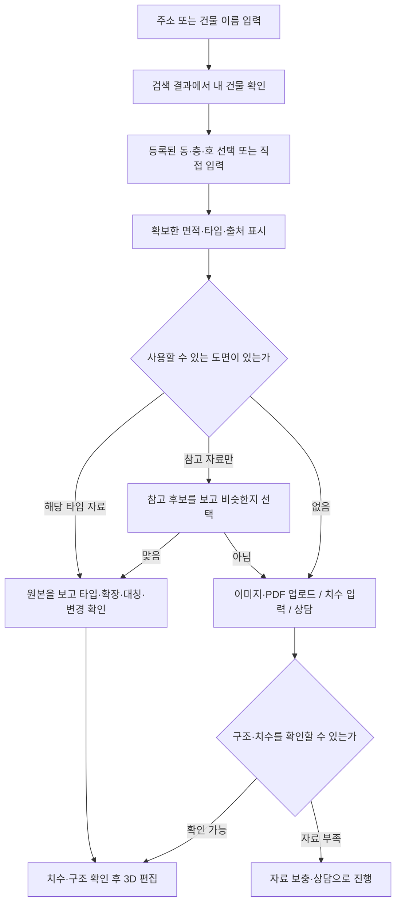

# 주소·건물·동호·평면도 정보 공급처 조사

조사일: 2026-10-08. 대상: 주소에서 내 공간을 찾고, 확보한 자료를 먼저 보여 준 뒤 부족한 정보만 고객이 보충하는 서비스.

이번 결과는 공식 문서·서비스 소개와 현재 코드의 비교다. 인증키를 사용한 실응답, 유료 계약, 특정 건물의 수록 여부를 검증한 결과는 아니다. 서비스 코드·DB·실행 서버는 변경하지 않았다.

## 1. 채택 제안

**행정안전부 주소 검색 + 상세주소 조회, 건축HUB 건축물대장, KOVI 아파트 도면 공급을 우선 검토한다.** 부지는 브이월드, 호별 타입 보강은 빅밸류를 추가 후보로 둔다. 이것은 조사 결과에 따른 구현 제안이며 이미 연결됐다는 뜻은 아니다.

중요한 발견은 두 가지다.

- 동·층·호를 조회하는 **공식 상세주소 API가 존재한다**. 등록된 결과가 있으면 고객이 호수를 직접 타이핑하는 대신 선택할 수 있다. 도로명주소 도움센터가 별도 신청과 호출 방법을 안내한다. [상세주소 API 신청 안내](https://eng.juso.go.kr/addrlink/qna/qnaDetail.do?bulletinRefSn=130131&currentPage=79&keyword=&noticeMgtSn=130131&noticeType=QNA&noticeTypeTmp=QNA&page=&searchType=), [동·층호 조회 방법](https://eng.juso.go.kr/addrlink/qna/qnaDetail.do?bulletinRefSn=134892&currentPage=70&keyword=&noticeMgtSn=134892&noticeType=QNA&noticeTypeTmp=QNA&page=&searchType=).
- **아파트 평면도 API를 공급하는 민간 업체도 존재한다.** 한국가상현실의 KOVI가 2D·3D 아파트 자료의 API 연계와 데이터셋 공급을 명시한다. 공공 건물정보 API만으로 도면을 얻는 것과는 별도 공급 경로다. [KOVI APT 공식 소개](https://corp.kovi.com/platform/p_koviapt.html).

호수가 조회된다는 사실, 호별 전용면적이 있다는 사실, 해당 호의 구조가 확인됐다는 사실은 각각 별개다. 세 정보를 따로 기록하고 확인해야 한다.

## 2. 공급처 비교

| 공급처 | 공식 자료에서 확인한 제공 정보 | 우리 서비스에서 맡길 역할 | 비용·준비 | 아직 확인해야 할 점 |
| --- | --- | --- | --- | --- |
| 행정안전부 도로명주소 + 상세주소 API | 주소 검색, 별도 API의 동·층·호 조회 | 건물 확인 → 등록된 동·호 선택 | 무료. 주소 검색 승인키와 상세주소 검색 승인 필요. 호출 한도는 제공기관 정책 확인 | 건물별 상세주소 등록 범위와 실제 결과 |
| 국토교통부 건축HUB 건축물대장 API | 표제부, 층별개요, 전유부, 전유공용면적 등 속성 | 건물 용도·층·면적 보충, 호별 면적 대조 | 무료. 공공데이터포털 활용신청·서비스키 | 선택한 동·호의 누락·중복·면적 구분, 실제 응답 스키마 |
| 한국가상현실 KOVI APT | 아파트 2D·3D 평면도 API·데이터셋 공급 | 타입별 원본 도면과 3D 자료 후보 | 공개 API 단가표·전체 명세 미확보. 공급 조건·견적 확인 | 편집 가능한 좌표/모델인지, 갈매스타힐스 수록, 동호 연결 여부 |
| 빅밸류 Data API | 호별 동명·호명·층·전유면적·공급면적·평형 타입 등 | 공공 데이터로 부족한 호별 타입 보강 | 가격 페이지는 문의 방식. 인증·계약 확인 | 타입 필드의 수록률·근거, KOVI 타입과 연결하는 키 |
| 국토교통부 브이월드 / 공간정보 | 연속지적도, 토지특성, 지도 | 부지 확인과 필지 형태·특성 표시 | 해당 공개 데이터는 무료 표기. 브이월드 인증키·도메인 설정 확인 | 레이어별 한도·좌표계·갱신 상태 |
| K-APT 단지 목록·기본정보 | 가입 단지의 주소·동수·세대수·관리·설비 정보 | 아파트 단지 검색·확인 보강 | 공공데이터포털 활용신청 | 모든 공동주택을 포함하는 것은 아님. 호별 도면 공급은 확인되지 않음 |
| 한국부동산원 공동주택 단지 식별정보 | 단지 식별, 대장·도로명주소 등에 쓰는 동명 연결 | 공급처 사이 단지·동 이름 대조 | 공개 CSV. API 이용은 별도 활용신청 | 연간 자료의 제공 대상·공란·기준시점 확인 |
| 청약홈 분양정보 API | 공고·분양 주택형별 정보 | 주택형 후보와 공식 분양 자료 찾기 보강 | 무료. 개발 자동승인·운영 심의 | 기존 모든 건물의 도면 목록이 아님 |
| 카카오맵 REST API | 주소/좌표 변환, 장소 검색 | 건물명 검색·지도 확인 보조 | 앱·REST API 키, 쿼터/유료 정책 확인 | 내부 평면도를 제공하는 API로 쓰지 않음 |
| 네이버 검색 API / API HUB | 웹·이미지 등의 검색 결과 | 도면 출처 링크 찾기 보조 | 신규 신청 체계 변경 확인 | 검색 결과는 도면 사용권·동호별 구조 확인을 보장하지 않음 |

비교표의 근거: [건축HUB](https://www.data.go.kr/data/15134735/openapi.do), [빅밸류 호 API](https://docs.bigvalue.ai/data/data/building/building-ho/), [빅밸류 가격](https://platform.bigvalue.ai/pricing), [연속지적도](https://www.data.go.kr/data/15056910/openapi.do), [토지특성](https://www.data.go.kr/data/15123549/openapi.do), [K-APT 목록](https://www.data.go.kr/data/15057332/openapi.do), [K-APT 기본정보](https://www.data.go.kr/data/15058453/openapi.do), [동 식별정보](https://www.data.go.kr/data/15106866/fileData.do), [청약홈](https://www.data.go.kr/data/15098547/openapi.do), [카카오맵 REST](https://developers.kakao.com/docs/ko/kakaomap/rest-api), [네이버 검색 소개](https://developers.naver.com/products/service-api/search/search.md).

## 3. 핵심 공급처별 연결 방법

### A. 행정안전부: 건물 → 동 → 층·호

주소 검색과 상세주소 검색은 서로 다른 서비스다. 기존 주소 검색 승인키가 상세주소에도 적용된다고 가정하지 않는다. 도움센터는 상세주소 검색 API를 별도로 신청하라고 안내한다.

비용 추가 확인: 공공데이터포털의 [주소 검색](https://www.data.go.kr/data/15057017/openapi.do)과 [상세주소 검색](https://www.data.go.kr/data/15096712/openapi.do) 모두 무료로 표기되어 있다. 상세주소는 개발 자동승인·운영 심의승인, 호출 한도는 기관 정책에 따른다고 안내한다. 공공데이터포털의 LINK 목록 등록과 실제 주소기반산업지원서비스 승인키 발급을 구분한다.

공식 안내의 상세주소 호출 주소는 다음과 같다.

```text
https://business.juso.go.kr/addrlink/addrDetailApi.do
```

건물의 `admCd`, `rnMgtSn`, `udrtYn`, `buldMnnm`, `buldSlno`를 전달하고, `searchType=dong`으로 동을 조회한다. 그 응답의 동명을 사용해 `searchType=floorho`, `dongNm`으로 층·호를 조회하는 흐름이다. 임의로 만든 동명을 보내지 않는다. 승인키는 `confmKey`다. [공식 기술 답변](https://eng.juso.go.kr/addrlink/qna/qnaDetail.do?bulletinRefSn=134892&currentPage=70&keyword=&noticeMgtSn=134892&noticeType=QNA&noticeTypeTmp=QNA&page=&searchType=).

실제 등록 결과에 401호가 있을 때만 “401호가 맞나요?”라는 선택지를 보여 준다. 없으면 호수를 직접 입력할 수 있게 한다. 호수 목록은 그 집의 거주자나 내부 구조를 확인하는 자료가 아니다.

### B. 건축HUB: 건물과 선택한 호의 속성

공식 건축HUB 서비스는 건축물대장 속성을 제공한다. 무료, 월간 갱신, 개발계정 트래픽 10,000으로 표기되어 있다. 전유부와 전유공용면적 조회를 활용할 수 있지만 해당 목록이 실내 벽·문 좌표를 뜻하지는 않는다. PK 전환 안내도 있으므로 식별자 버전을 함께 관리한다. [공식 제공 범위·조건](https://www.data.go.kr/data/15134735/openapi.do).

현재 코드가 사용하는 `BldRgstHubService/getBrTitleInfo`, `getBrExposPubuseAreaInfo`는 활용가이드와 실응답을 대조할 대상이다. 특히 호출에 동·호를 넣었다는 이유만으로 그 호만 반환됐다고 가정하지 않는다. 반환값의 건물·동·호·층을 확인하고, 여러 페이지·전유/공용 구분을 처리한 뒤 면적을 표시해야 한다.

공급면적·전용면적·연면적은 별도 값으로 보관한다. 전용면적 하나만으로 가로·세로나 방 구성을 생성하지 않는다.

### C. KOVI: 실제 아파트 도면 공급의 우선 후보

KOVI는 아파트 평형 자료를 API 또는 데이터셋으로 공급하며, 공간데이터 안내에는 2D CAD와 여러 도면 출력 형태가 나온다. 공급자 보도자료는 URL/API 방식과 3D 이미지·메타데이터를 설명한다. [API 공급](https://corp.kovi.com/platform/p_koviapt.html), [공간데이터](https://corp.kovi.com/solution/solution04.html), [API 출시 안내](https://corp.kovi.com/news/EN_news_view.asp?intnum=2113).

**우리 편집기에 필요한 구조 데이터를 받을 수 있는지는 아직 미확인이다.** 3D 이미지나 뷰어 링크를 받아 보여 주는 기능과, 고객이 가구를 놓고 벽·문을 편집하는 기능은 요구하는 데이터가 다르다. 벽·문·창·방 좌표 또는 변환 가능한 CAD/모델과 단위·축척이 필요하다.

공급자의 도면 페이지도 공개 자료를 참고해 제작하여 실제 공간과 차이가 있을 수 있다고 안내한다. 보유량이나 홍보상 수록률을 모든 빌라·원룸·모든 호수의 최신 실내 구조 확보로 해석하지 않는다. [자료 주의사항](https://kovi.com/ReferenceRoom/Apt).

계약 전에 받을 답과 샘플은 아래 8절에 정리했다.

### D. 빅밸류: 호수에서 타입으로 연결할 추가 후보

공개 호 API의 출력에는 `dong_name`, `ho_name`, `floor_number`, `private_area`, `supply_area`, `pyeong_type_name` 등이 있다. 타입은 선택 필드이므로 모든 호에 채워진다고 보장할 수 없다. 동키·단지키·도로명주소 관리번호·PNU 등으로 조회하는 명세도 공개되어 있다. [호 API 명세](https://docs.bigvalue.ai/data/data/building/building-ho/).

이 타입을 도면 공급처의 타입과 연결하면 동·호 확인 후 도면 후보를 줄일 가능성이 있다. 이는 조합에 대한 추론이며 두 공급처 사이 연결이 검증된 것은 아니다. 건물 식별, 전용면적, 타입 정의·표기, 기본/확장, 좌우 대칭까지 대조해야 한다.

별도 분양 평형 API는 타입·면적 등의 속성을 제공한다. 정보콘텐츠 상품 소개의 도면 항목은 단면도·배치도로 표기되어 있어, 그것만으로 세대 내부 평면도 공급을 확정하지 않는다. [분양 평형 명세](https://docs.bigvalue.ai/data/data/bunyang/bunyang-area-type/), [상품 소개](https://platform.bigvalue.ai/industry/contents).

### E. 부지·공장·지식산업센터

부지는 연속지적도와 토지특성 정보를 우선 검토한다. 필지의 모양과 속성은 부지를 찾는 데 도움이 되지만 실내 평면도도, 새 건물 설계도도 아니다. [연속지적도](https://www.data.go.kr/data/15056910/openapi.do), [토지특성](https://www.data.go.kr/data/15123549/openapi.do).

브이월드 지도는 인증키와 도메인 설정을 사용하는 공식 연결 경로가 있다. 실제 연계 전 레이어 접근 조건·좌표계를 확인한다. [지도 API 안내](https://www.vworld.kr/dev/v4dv_opn2dmap2guide_s001.do).

공장·지식산업센터는 주소와 건축물대장으로 건물·층·용도를 먼저 확인하고, 소유자·관리자·임차인이 가진 임대 구획 도면으로 실제 사용 공간을 보충하는 흐름을 제안한다. 이번 조사에서 해당 건물의 호별 내부 도면을 전국적으로 공급하는 공식 API는 확인하지 못했다.

## 4. 공간 유형별로 고객에게 먼저 줄 정보

아래는 구현 제안이다. 실제 수록 여부에 따라 빈값을 허용하며, 등록 용도와 고객이 쓰려는 공간 유형도 구분한다.

| 고객 공간 | 플랫폼이 먼저 찾을 정보 | 구조 자료가 부족하면 고객에게 받을 것 |
| --- | --- | --- |
| 아파트 | 단지·동·호, 확인 가능한 전용면적·타입, 공급 가능한 타입 도면 | 타입 선택, 확장·대칭·이전 변경 확인, 부족한 치수 |
| 빌라·연립·다세대 | 주소·건물, 등록된 호수, 대장이 제공하는 면적 | 해당 세대 도면 또는 치수·손그림 |
| 원룸·다가구 | 주소·건물·등록된 상세주소, 확인 가능한 층 정보 | 호수 누락 시 직접 입력, 내 방 형태·치수 또는 도면 |
| 오피스텔 | 건물·동·호, 제공되는 면적·타입 | 실제 타입 대조, 미수록 도면·변경 내용 |
| 단독주택 | 주소·건물, 층별 속성 | 공사할 층 선택, 층별 도면·실측 |
| 사무실·상가 | 건물·층·확인 가능한 구획 속성 | 현재 임차 구획, 내부 칸막이·설비·치수 |
| 공장·창고 | 건물·층·용도·대장 면적 | 작업 구역, 기둥·높이·설비 위치, 해당 층 도면 |
| 지식산업센터 | 건물·동·호·확인 가능한 전유 면적 | 합친/나눈 호실 여부, 임대 구획 도면·설비 |
| 부지 | 지번·필지 형태·토지특성 | 작업 대상 경계·계획, 측량/현장 자료가 필요한 부분 |

아파트 도면을 일반 빌라나 지식산업센터에 복제하지 않는다. 같은 층·근처 공간도 실제 구조가 같다는 근거는 아니다.

## 5. 고객 흐름



자료가 사진뿐이거나 구조·축척을 확인할 수 없으면 상담·수동 입력으로 진행한다. 모든 자료가 자동 3D로 변환된다고 약속하지 않는다.

자료별 상태는 다음처럼 나눈다.

1. **동·호 연결 근거가 있는 도면 후보:** 근거와 원본 출처를 보여 주고 고객이 현재 구조를 확인한다.
2. **같은 단지의 타입 도면:** “이 타입이 맞나요?”라고 묻는다. 특정 호 도면이라고 표시하지 않는다.
3. **유사한 구성의 참고 사례:** 참고라고 표시하고 선택을 받는다. 고객 실제 공간과 별도로 보관한다.
4. **없거나 조회 실패:** 업로드·치수·상담 경로로 이어진다. 조회 실패와 미수록을 다른 상태로 기록한다.

## 6. 갈매스타힐스에서 확인해야 할 것

현재 등록 내용은 프로젝트 문서 `docs/ai-floorplans.md` 기준이다. 이번에 유료 공급처에서 새로 받아 검증한 자료가 아니다.

- 주소는 경기도 구리시 산마루로 46, KB 단지 출처는 [갈매스타힐스(갈매4단지)](https://www.kbland.kr/se/c/29883)다.
- 현재 코드에는 기본형 7타입 그림이 등록되어 있지만 동·호 → 타입 연결표는 없다. 112A만 참고 배치가 준비되어 있다.
- 상세주소 API에 해당 단지의 동·호가 나오는지, 건축HUB에서 선택 호 면적이 확인되는지, 민간 공급처에서 그 타입과 도면을 연결할 수 있는지가 후속 실연동 확인 대상이다.
- 확인이 끝나기 전에는 특정 동·호를 입력했다는 이유만으로 112A를 자동 선택하지 않는다.

갈매스타힐스를 공급처 비교용 첫 샘플로 쓰고, 빌라·원룸·지식산업센터도 각각 별도 샘플로 수록 여부를 조사해야 한다.

## 7. 현재 코드와 비교해서 발견한 후속 수정 사항

코드 읽기 기준의 개발 목록이다. 이번 조사에서는 고치지 않았다.

| 위치 | 현재 상태 | 다음 연결 작업에서 할 일 |
| --- | --- | --- |
| `lib/address.ts` | 도로명주소 검색만 있음 | 상세주소 API 연결, 필요한 도로명/건물 식별 필드 보존 |
| `lib/address.ts`의 건축HUB 조회 | 앞 50건과 서버 필터에 의존. 표제부에서 일치 동이 없으면 첫 건을 선택 | 응답의 동·호 확인, 페이지 처리, 일치하지 않으면 후보 재선택·미확인 처리 |
| `lib/address.ts`의 도면 발급 안내 | 세입자는 소유자 동의가 필요하다고 일괄 안내 | 임차인도 규칙상 발급 대상에 포함될 수 있도록 안내 수정, 실제 증빙 절차는 세움터로 연결 |
| `lib/floorplan/catalog.ts` | 등록된 공개 이미지 목록 | 계약된 도면 공급처 어댑터와 건물·타입 연결 근거 추가 |
| `lib/floorplan/search.ts` | 기존 NAVER Developers 검색 API 경로 | 신규 키는 API HUB 신청·인증·명세를 기준으로 연동 검토 |
| `docs/ai-floorplans.md` | 기존 키 신청 및 공개 도면 안내 | 이번 공급처 조사와 연결, 기존 성공/실패 기록은 유지 |

정부24는 평면도·현황도 발급을 세움터에서 신청하도록 안내한다. 규칙 제11조제3항에는 임차인 등의 발급 대상도 있으므로 “세입자는 반드시 소유자 동의”라고 단정하지 않는다. 이것은 안내 문구 수정 근거이며, 플랫폼이 모든 건물 도면을 자유롭게 발급받을 수 있다는 뜻은 아니다. [정부24 안내](https://www.gov.kr/mw/AA020InfoCappView.do?CappBizCD=15000000098), [현황도 발급 대상 규칙](https://www.law.go.kr/lsLinkCommonInfo.do?chrClsCd=010202&lsJoLnkSeq=1031391211).

네이버 공식 공지는 2026-07-31 이후 검색 API 신규 신청을 API HUB로 옮겼으며 기존 서비스는 2027-06-30까지 지원한다고 설명한다. 새 연동에서 이전 Client ID/Secret 발급 안내만 제공하면 맞지 않는다. [API 이관 공지](https://developers.naver.com/notice/article/32530).

## 8. 민간 공급처에 확인할 내용

외부 문의를 전송하지 않았으며, 아래는 문의 문안과 확인 목록이다. 공개 소개에 없는 조건을 추측해 구현하지 않는다.

### KOVI에 보낼 문의 문안

> 주소·단지·동호를 확인한 고객에게 평면도를 제공하고, 고객이 자체 3D 편집기에서 가구와 상품을 배치한 뒤 시공 제안을 요청하는 서비스를 개발 중입니다. 아파트 타입별 2D/3D 데이터 공급을 검토하려고 합니다. 갈매스타힐스(경기도 구리시 산마루로 46)의 제공 가능한 타입·기본형/확장형·좌우 대칭 자료와 샘플 응답을 부탁드립니다. 이미지/뷰어 외에 벽·문·창·방 좌표, CAD 또는 편집 가능한 3D 모델을 제공하는지, 동호별 타입 연결 여부, 외부 편집기 사용·변환·저장·PDF 및 제안서 공유 권한, 과금·최소 계약·시험 키 조건을 알려 주세요.

공식 문의 경로: [한국가상현실 비즈니스 문의](https://corp.kovi.com/support/biz_faq.asp).

### 빅밸류에 확인할 내용

- 호 API의 `pyeong_type_name`은 어떤 자료와 식별 기준으로 채우는가? 갈매스타힐스 샘플에 동·호·면적·타입이 있는가?
- 아파트 외 빌라·오피스텔·지식산업센터의 호별 필드 제공 범위는 무엇인가?
- 타입을 도면 공급처 자료와 연결할 공식 키·매핑 또는 제휴 상품이 있는가?
- 외부 서비스 표시·캐시·저장·프로젝트 요청 기록 보관 권한과 호출 단가는 무엇인가?

문의 경로와 가격 안내: [빅밸류 Pricing](https://platform.bigvalue.ai/pricing).

### 샘플을 받았을 때 통과해야 할 확인

| 확인 | 통과 조건 |
| --- | --- |
| 건물 일치 | 도로명/지번·공급처 건물 ID를 교차 확인 |
| 호 일치 | 해당 동·호·층의 식별 근거 확인. 인접 호 자료로 대체하지 않음 |
| 타입 일치 | 전용면적과 타입 의미·기본/확장·대칭 구분 확인 |
| 편집 가능 | 실제 좌표/모델을 편집기에 넣어 벽·문·창·단위를 대조 |
| 범위 표시 | 현재 제공되는 구조와 미확인·고객 입력 항목이 구분됨 |
| 이용 조건 | 표시·변환·편집·저장·제안서 전달이 계약 범위에 들어감 |
| 누락 대응 | 결과 없음·키 오류·시간 초과 모두 고객 입력 경로로 이어짐 |
| 기존 연결 | 고객 수정 버전과 업체에 보낸 기준이 기존처럼 보관됨 |

## 9. 확보할 승인·계정과 순서

1. **행정안전부:** 주소 검색과 상세주소 검색을 각각 신청·승인한다. 호수 선택 편의를 먼저 확보한다.
2. **공공데이터포털:** 건축HUB 건축물대장 서비스를 활용 신청한다. 공공 키 하나를 받았다고 모든 서비스 권한이 있는 것은 아니다.
3. **KOVI:** API 명세·샘플·계약 조건을 받아 편집 가능한 자료와 목표 단지 수록 여부를 검토한다. 우리 핵심 3D 흐름에 맞는지 먼저 확인한다.
4. **빅밸류:** 공공 정보와 KOVI로 동호별 타입 연결이 부족할 때 샘플을 비교한다. 당장 두 민간 공급처를 모두 계약할 필요는 없다.
5. **브이월드:** 부지 지원용 인증키·지도/필지 레이어를 준비한다.
6. **보조 자료:** K-APT·청약홈·동 식별정보는 단지 검색과 공급처 간 연결 품질에 도움이 되는 경우 추가한다. 카카오/네이버는 지도·출처 탐색 목적에 맞춰 선택한다.

비용은 공공 API 사용료와 민간 도면 공급료를 분리해 산정한다. 민간 단가·수록률·편집 권한은 공개 자료만으로 확정하지 않았다.

## 10. 이번 단계의 완료와 남은 검증

완료: 공공·민간 공급처의 역할 구분, 핵심 후보 선정, 공식 출처 확보, 유형별 입력 보충 흐름, 현재 코드의 연결 공백, 공급처 문의·샘플 확인 목록.

미완료: 실키 호출, 갈매스타힐스 등의 동호 응답 확인, 유료 공급처 계약·샘플 확보, 도면 데이터 변환·편집 검증, 다중 공급처 식별자 연결, 서비스 구현·배포.

일부 사이트의 동적 API 명세와 검색 화면은 이번 열람에서 확인되지 않았다. 이를 실제 연동 실패나 데이터 미수록으로 집계하지 않았다. 상품 가격·가입 정책·데이터 목록은 연결 시점에 다시 확인한다.
